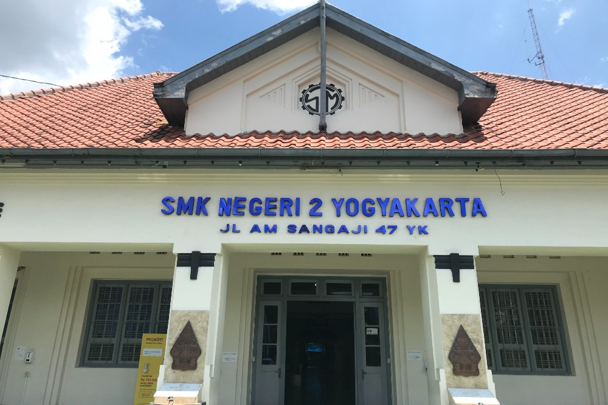

<div align="center">

  # ✦ SMKN 2 Yogyakarta — Web Portal ✦

  

> *The Industrial Culture School — Official Web Application*

[](https://laravel.com)
[](https://www.php.net)
[](https://vitejs.dev)
[](https://www.docker.com)
[](./LICENSE)

· · ────────────── · ·

*Modern, fast, and responsive school profile web portal built with Laravel, Blade Components, and Tailwind CSS.*

> 🏫 _Sekolah Pusat Keunggulan (Center of Excellence)_ ✦

· · ────────────── · ·

</div>

---

## ✦ Table of Contents

- [What is Web SMKN 2 Yogyakarta?](#-what-is-web-smkn-2-yogyakarta)
- [Features](#-features)
- [Requirements](#-requirements)
- [Installation](#-installation)
- [Quick Start](#-quick-start)
- [Project Structure](#-project-structure)
- [Tech Stack Comparison](#-tech-stack-comparison)
- [Disclaimer](#-disclaimer)
- [Contact & Support](#-contact--support)
- [Developer](#-developer)
- [License](#-license)

---

## ✦ What is Web SMKN 2 Yogyakarta?

**Web Portal SMKN 2 Yogyakarta** adalah aplikasi web resmi sekolah berbasis **Laravel** yang dirancang untuk memberikan informasi terpadu, interaktif, dan modern mengenai profil sekolah, program keahlian (jurusan), berita, Teaching Factory (TeFa), serta informasi PPDB bagi siswa, guru, alumni, dan masyarakat umum.

Cocok untuk:

﹒Menampilkan profil dan keunggulan sekolah ke publik
﹒Portal informasi jurusan, kurikulum, dan fasilitas vokasi
﹒Publikasi berita, prestasi siswa, dan agenda kegiatan
﹒Integrasi alur PPDB dan layanan informasi digital sekolah

---

## ✦ Features

· · ────────────── · ·

**Frontend & User Experience**

| Feature | Status |
|---|---|
| Modern Bento Grid Statistik & Prestasi | Supported |
| Dynamic Hero Section & Typography | Supported |
| Responsive Layouts (Mobile, Tablet, Desktop) | Supported |
| Fast Asset Bundling with Vite & Tailwind CSS | Supported |
| Modular Blade Components Architecture | Supported |

· · ────────────── · ·

**Informasi & Akademik**

| Feature | Status |
|---|---|
| Program Keahlian / Jurusan Vokasi | Supported |
| Pusat Informasi PPDB Online | Supported |
| Berita, Pengumuman & Dokumentasi Sekolah | Supported |
| Profil Teaching Factory & Kemitraan Industri | Supported |

· · ────────────── · ·

**Technical & Infrastructure**

| Feature | Status |
|---|---|
| Docker & Docker Compose Containerization | Supported |
| Automated CI/CD GitHub Actions Workflow | Supported |
| SQLite / MySQL Database Ready | Supported |
| SEO Optimized Semantic HTML5 Structure | Supported |

---

## ✦ Requirements

> [!CAUTION]
> **Pastikan versi environment Anda sesuai sebelum memulai.**
>
> Aplikasi ini memerlukan **PHP 8.2 ke atas** dan **Node.js v18 ke atas**. Pastikan ekstensi PHP yang dibutuhkan (`pdo_sqlite`, `curl`, `mbstring`, `fileinfo`, `zip`) telah diaktifkan.

· · ────────────── · ·

| Komponen | Versi Minimal | Versi Rekomendasi |
|---|---|---|
| **PHP** | `v8.2.0` | `v8.3` atau `v8.4` |
| **Composer** | `v2.2+` | Versi Terbaru |
| **Node.js** | `v18.0.0` | `v20 LTS` atau `v22` |
| **NPM** | `v8+` | Versi Terbaru |
| **Docker (Opsional)** | `v20.10+` | Docker Desktop Terbaru |

---

## ✦ Installation

### 1. Clone Repository
```bash
git clone https://github.com/SUCODE-TEAM/web-smk.git
cd web-smk
```

### 2. Install PHP & Node Dependencies
```bash
# Install PHP dependencies
composer install

# Install Frontend dependencies
npm install
```

### 3. Setup Environment File
```bash
# Windows (PowerShell)
copy .env.example .env

# Linux / macOS
cp .env.example .env
```

### 4. Generate Application Key & Migrate Database
```bash
php artisan key:generate
php artisan migrate
```

> [!NOTE]
> Jika menggunakan SQLite, pastikan file database tersedia di `database/database.sqlite`.

---

## ✦ Quick Start

### Opsi A: Menjalankan secara Lokal

1. **Jalankan Vite Development Server (Aset CSS/JS):**
   ```bash
   npm run dev
   ```

2. **Jalankan Laravel Server (Terminal Terpisah):**
   ```bash
   php artisan serve
   ```

3. Buka browser di [http://localhost:8000](http://localhost:8000).

---

### Opsi B: Menjalankan Menggunakan Docker

Cukup satu perintah untuk menjalankan seluruh stack menggunakan Docker:

```bash
docker compose up --build
```

Aplikasi langsung siap diakses pada port `8000`.

> [!TIP]
> Jalankan `npm run build` sebelum mendeploy ke server produksi untuk mengoptimalkan file CSS dan Javascript ke direktori `public/build/`.

---

## ✦ Project Structure

```
web-smk/
·
├── app/                    # Core application logic & Models
│   ├── Http/Controllers/  # Route Controllers
│   ├── Models/            # Eloquent Database Models
│   └── Providers/         # Service Providers
·
├── config/                 # Konfigurasi aplikasi Laravel
├── database/               # Migrations, seeders, & SQLite database
│   ├── factories/
│   ├── migrations/
│   └── seeders/
·
├── public/                 # Static assets, images, & compiled build
│   ├── build/              # Hasil build Vite
│   └── hero-bg.jpg         # Hero & media visual
·
├── resources/              # Views, CSS, and Frontend JavaScript
│   ├── css/                # Styling (Tailwind / Custom CSS)
│   ├── js/                 # Client script
│   └── views/              # Blade templates & components
│       ├── components/     # Layout, Navbar, Footer
│       └── home.blade.php  # Halaman Beranda
·
├── routes/                 # Web & Console Routes (web.php)
├── storage/                # Logs, cache, and uploaded files
├── Dockerfile              # Docker container definition
├── docker-compose.yml      # Multi-container orchestration
└── vite.config.js          # Vite build configuration
```

---

## ✦ Tech Stack Comparison

Perbandingan keunggulan arsitektur Web SMKN 2 Yogyakarta:

| Kriteria | **Laravel + Vite (Modern Stack)** | WordPress Tradisional | Framework Frontend Standalone |
|---|:---:|:---:|:---:|
| Performa & Kecepatan | ✦ Cepat | Lambat | ✦ Cepat |
| Keamanan Aplikasi | ✦ Sangat Tinggi | Rentan Plugin | ✦ Tinggi |
| Kustomisasi Komponen | ✦ Fleksibel | Terbatas Theme | ✦ Fleksibel |
| SEO & SSR Ready | ✦ Bawaan (Blade) | ✦ Bawaan | Perlu Konfigurasi Tambahan |
| Maintenance & Deployment | ✦ Praktis (Docker) | Rumit | Butuh Backend Terpisah |

---

## ✦ Disclaimer

> [!WARNING]
> **Penggunaan Konten & Hak Cipta**
>
> Seluruh aset grafis, logo, dan konten publikasi yang berkaitan dengan SMKN 2 Yogyakarta dilindungi hak cipta. Penggunaan untuk keperluan di luar instansi harus mendapat izin dari pihak terkait.

---

## ✦ Contact & Support

Informasi lebih lanjut dan kontribusi pengembangan:

· · ────────────── · ·

| Platform | Keterangan |
|---|---|
| **Website Resmi** | [SMKN 2 Yogyakarta](https://www.smk2-yk.sch.id/) |
| **Repository GitHub** | [SUCODE-TEAM/web-smk](https://github.com/SUCODE-TEAM/web-smk) |
| **Lokasi** | Jl. AM. Sangaji No.47, Cokrodiningratan, Kec. Jetis, Kota Yogyakarta |

## ✦ Developer

Developed and maintained by **SUCODE TEAM**:

<div align="center">

<a href="https://github.com/SUCODE-TEAM">
  
</a>

### **SUCODE TEAM**
*Software & Technology Development*

[](https://github.com/SUCODE-TEAM)
[](https://github.com/SUCODE-TEAM/web-smk)

</div>

---

## ✦ License

Aplikasi ini dirilis di bawah lisensi **MIT License** — bebas untuk digunakan dan dikembangkan.

---

<div align="center">

· · ────────────── · ·


> 💻 _Engineered with precision by **SUCODE TEAM**_ ✦

· · ────────────── · ·

*Last updated: 2026*

</div>
